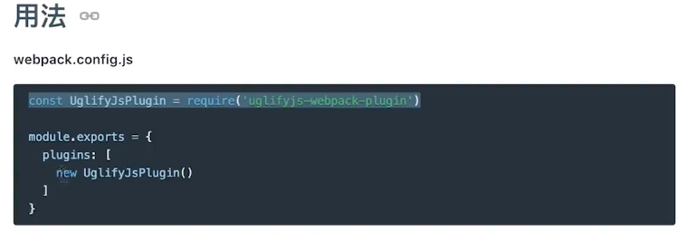
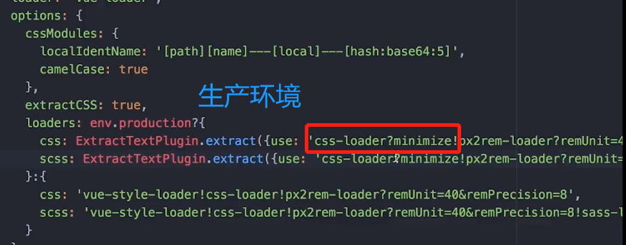
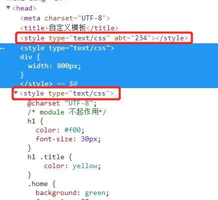

---
typora-copy-images-to:media
---


## 环境

node 8.9.1

### nvm

#### window

window上没有支持, 使用`nvm-windows`代替.

https://github.com/coreybutler/nvm-windows

> This is not the same thing as nvm, which is a completely separate project for Mac/Linux only.


安装完nvm后, 已有的node若交给nvm控制, 则会并入到nvm中, 原先的文件夹会消失, 环境变量也会消失. 

新增`NVM_HOME`, `NVM_SYMLINK`.


##### 基本使用

```
nvm		//查看相关信息
nvm ls-remote		//查看目前可以安装的版本
nvm list	//查看当前系统所有的node版本
nvm install {版本号}	//安装指定版本的node
```

执行`nvm use 8.9.1`后就会产生`NVM_SYMLINK`对应的物理目录.


#### Ubuntu

[](https://github.com/creationix/nvm)

```shell
curl -o- https://raw.githubusercontent.com/creationix/nvm/v0.33.11/install.sh | bash
```

执行完毕后, 会在`~/.bashrc`尾部追加:

```shell
export NVM_DIR="$HOME/.nvm"
[ -s "$NVM_DIR/nvm.sh" ] && \. "$NVM_DIR/nvm.sh"  # This loads nvm
[ -s "$NVM_DIR/bash_completion" ] && \. "$NVM_DIR/bash_completion"  # This loads nvm bash_completion
```


```
nisus@yoga:~$ nvm install 8.9.1
Downloading and installing node v8.9.1...
Downloading https://nodejs.org/dist/v8.9.1/node-v8.9.1-linux-x64.tar.xz...
###################################################################################################################################################################### 100.0%
Computing checksum with sha256sum
Checksums matched!
Now using node v8.9.1 (npm v5.5.1)
Creating default alias: default -> 8.9.1 (-> v8.9.1)
```


## npm


### npm源


一、使用淘宝镜像
1.临时使用
npm --registry [https://registry.npm.taobao.org](https://link.jianshu.com?t=https://registry.npm.taobao.org) install express

2.持久使用
npm config set registry [https://registry.npm.taobao.org](https://link.jianshu.com?t=https://registry.npm.taobao.org)
若无效使用:
~~`npm config set registry http://registry.npm.taobao.org/`~~

3.通过cnpm
npm install -g cnpm --registry=[https://registry.npm.taobao.org](https://link.jianshu.com?t=https://registry.npm.taobao.org)

二、使用官方镜像
npm config set registry [https://registry.npmjs.org/](https://link.jianshu.com?t=https://registry.npmjs.org/)

三、查看npm源地址
npm config get registry


使用**cnpm**:

`npm install cnpm -g --registry=https://registry.npm.taobao.org ` 

```
>> cnpm config get registry
https://registry.npm.taobao.org/
```


```
npm config set registry http://registry.cnpmjs.org //配置指向源
```


### npm cache

`npm install`或`npm update`命令，从 registry 下载压缩包之后，都存放在本地的缓存目录。

这个缓存目录，在 Linux 或 Mac 默认是用户主目录下的`.npm`目录，在 Windows 默认是`%AppData%/npm-cache`。通过配置命令，可以查看这个目录的具体位置。

```
>> npm config get cache
C:\Users\60906\AppData\Roaming\npm-cache
```


> 查看模块全局安装位置

```
>> npm config get prefix
D:\Developer\nvm\nvm-nodejs
```


> `--save-dev` `--save`

主要和`package.json`中`dependencies`和`devDependencies`节点有关.

devDependencies 节点下的模块是我们在开发时需要用的，比如项目中使用的 gulp ，压缩css、js的模块。这些模块在我们的项目部署后是不需要的，所以我们可以使用 -save-dev 的形式安装。像 express 这些模块是项目运行必备的，应该安装在 dependencies 节点下，所以我们应该使用 -save 的形式安装。


### 替代方案

**yarn**

```
#全局安装yarn
npm install -g yarn
#项目初始化依赖时:
yarn install
#后期增加模块时:
yarn add 模块
```


## js模块化


* viewport

```
<meta name="viewport" content="width=device-width, initial-scale=1.0">
```


* `rem` & `em`

rem: html标签的font-size.

em: 父标签的font-size


* 自适应

自动调整html的font-size(即`rem`), `rem`作为基准像素.


> 单页Web应用（single page web application，SPA），就是只有一张Web页面的应用，是加载单个HTML 页面并在用户与应用程序交互时动态更新该页面的Web应用程序。


> * Prerender预渲染优化SEO

SPA不利于SEO.


> * spa工作原理

- history
- hash


## 部署

> 资源

https://doc.webpack-china.org/guides/productin/

### js压缩

> 加载css后加载js, 当js在body后面时, 这其中的间隙就可以用来很好的渲染页面, 若有的话.


`uglifyjs`插件(*uglify: 使变得丑陋, 压缩的js当然非常的丑了).*

安装: 

```
npm i -D uglifyjs-webpack-plugin
```

*-D == -save-dev, 保存以来的包名和版本信息到`devDependencies`*




```
npm run build
```

### css压缩

cssloader





### 调试

开启`sourceMap`.


build后`dist/`下新增:


应用的min.js末尾会出现上图.


### 发布部署


上线前两件事要记得检查:

- 最后不要忘了检查是否开启了gzip压缩. 
- 不要忘了更新CDN.


## 构建工具


基础配置: 一般来说必须.

- entry 入口, webpack要构建那个文件.
- module 配置各种loader, 什么文件用什么loader去解析.
- plugins 非必选, 但一般都会有的.
- output 制定输出.

进阶配置:

- resolve 怎么查询文件
- devtool 工具
- devServer 开启服务


### 安装:


```
npm install --save-dev webpack-dev-server
npm i vue-loader style-loader css-loader sass-loader -D
npm i vue vue-router		//讲师没有带 -D

npm install --save-dev html-webpack-plugin --no-optional
npm i clean-webpack-plugin -D --no-optional
```


*Tip: `npm list`会提示依赖错误*


#### 报错:

```
npm WARN webpack-dev-server@3.1.4 requires a peer of webpack@^4.0.0-beta.1 but none is installed. You must install peer dependencies yourself.   //貌似没啥事, 讲师安装的时候也有类似的警告
```

==>

```
npm i webpack -D
```


##### -4048 operation not permitted .. Please try running this command again as root/Administrator

简言之, 安装包时提示需要管理员权限.

**Tip**: 首先检查是否安装了已经有的包, **若是安装已经有的**(*版本旧或上次没有安装OK*), 则要**确保`webpack-dev-server`或其他服务处于停止状态**. 因为有些服务刚好正在使用你正在重新安装的包的部分文件. 导致无法删除(*没有权限删除, 因为文件被占用*).  

然后, 再考虑其他原因.

```
>> npm install --save-dev webpack-dev-server
npm ERR! path D:\Work\JAVA\workspace\Mooc\JD\MyJDFinance\node_modules\fsevents\node_modules\sax\lib\sax.js
npm ERR! code EPERM
npm ERR! errno -4048
npm ERR! syscall unlink
npm ERR! Error: EPERM: operation not permitted, unlink 'D:\Work\JAVA\workspace\Mooc\JD\MyJDFinance\node_modules\fsevents\node_modules\sax\lib\sax.js'
npm ERR!  { Error: EPERM: operation not permitted, unlink 'D:\Work\JAVA\workspace\Mooc\JD\MyJDFinance\node_modules\fsevents\node_modules\sax\lib\sax.js'
npm ERR!   stack: 'Error: EPERM: operation not permitted, unlink \'D:\\Work\\JAVA\\workspace\\Mooc\\JD\\MyJDFinance\\node_modules\\fsevents\\node_modules\\sax\\lib\\sax.js\'',
npm ERR!   errno: -4048,
npm ERR!   code: 'EPERM',
npm ERR!   syscall: 'unlink',
npm ERR!   path: 'D:\\Work\\JAVA\\workspace\\Mooc\\JD\\MyJDFinance\\node_modules\\fsevents\\node_modules\\sax\\lib\\sax.js' }
npm ERR!
npm ERR! Please try running this command again as root/Administrator.

npm ERR! A complete log of this run can be found in:
npm ERR!     C:\Users\60906\AppData\Roaming\npm-cache\_logs\2018-07-22T16_14_04_778Z-debug.log
```


解决: 加上`--no-optional` (https://stackoverflow.com/questions/46020018/error-eperm-operation-not-permitted-unlink-d-sources-node-modules-fseven)

```
npm install --save-dev webpack-dev-server  --no-optional
```

> fsevent是mac osx系统的，你是在win或者Linux下使用了 所以会有警告，忽略即可  [https://segmentfault.com/q/1010000004498934]


##### 'webpack-dev-server' 不是内部或外部命令，也不是可运行的程序或批处理文件。

全局安装`npm install -g webpack-dev-server`

然后, `npm install webpack-cli -D --no-optional`


##### nvalid configuration object. Webpack has been initialised using a configuration object that d oes not match the API schema.  unknown property 'loaders'.

> 把module里的那个loaders改成rules [https://segmentfault.com/q/1010000013456976]


##### Error compiling template:

[慕课问题页](https://coding.imooc.com/learn/questiondetail/69974.html)

我按照[GitHub](http://https//github.com/vuejs/vue-loader/issues/780)的方法, 将`<template lang="html">`中的`lang="html"`删除. 同时, 删除了`style`中内容. 可以编译成功.

接下来解决, 怎么让其**识别style**?

**Try 1:**

[ref](https://github.com/vuejs/vue-loader/issues/415)


==> 报`没有node-sass模块` ==> 安装`npm install node-sass --no-optional` ==> 

成功!


**Try 2**:

```
//try: 解决style编译问题 failed , 还是得加 lang="scss"
options: {
    loaders: {
        // Since sass-loader (weirdly) has SCSS as its default parse mode, we map
        // the "scss" and "sass" values for the lang attribute to the right configs here.
        // other preprocessors should work out of the box, no loader config like this necessary.
        'scss': 'vue-style-loader!css-loader!sass-loader',
        'sass': 'vue-style-loader!css-loader!sass-loader?indentedSyntax'
	}
	// other vue-loader options go here
}
```


**看来, 还是得`lang="scss"`了**!


### px->rem


1. 怎么配置vue-loader
2. 找到具体的loader可以做这件事. (进入`npmjs`网站, 搜索关键词: 'px rem')


**Tip:** 自己构建工具, 比使用`vue-cli`更灵活方便.


```
#我的环境
px2rem@0.5.0
webpack@4.16.1
webpack-dev-server@3.1.5
```


### css模块


使用vue-loader的cssModule功能

```
//options增加:
cssModules: {
    localIdentName: '[path][name]---[local]---[hash:base64:5]',
    camelCase: true
},

```


But: 没有生效.

还是用vue自带的scope吧.

**Tip:** scope和module区别: 前者样式是通过生成vue模块属性区分的, `className[属性名]`, 后者是生成不同的类名模拟的.


[vue-loader文档](https://vue-loader-v14.vuejs.org/zh-cn/)


### 提取css文件

*11-5 构建工具-5*

[配置参考文档](https://vue-loader-v14.vuejs.org/zh-cn/configurations/extract-css.html)

提取css到单个文件. 

抽取前:




默认安装的插件版本: ` extract-text-webpack-plugin@3.0.2`


**Error**: Chunk.entrypoints: Use Chunks.groupsIterable and filter by instanceof Entrypoint instead

**解决**:

[](https://www.cnblogs.com/telder/p/9039544.html)

```
>> npm install extract-text-webpack-plugin@next
+ extract-text-webpack-plugin@4.0.0-beta.0
```


但, 抽取没有生效. 先用的简单配置, 不起作用, 换成自定义配置后, 依然不起作用.


### 区分开发和上线环境不同的任务

DefinePlugin: 这个插件用来定义全局变量，在webpack打包的时候会对这些变量做替换。([](https://juejin.im/post/5868985461ff4b0057794959)) 


**通过命令行参数传入参数**:


```
npm [run] rest
npm [run] start
npm run build
npm run watch
```


### 省略常用文件后缀

[webpack/extention文档](https://webpack.docschina.org/configuration/resolve/#resolve-extensions)


### Eslint配置


读取配置文件的优先级自上而下.

[eslint文档](https://eslint.org/docs/user-guide/getting-started)

[rules文档](https://eslint.org/docs/rules/)

[针对vue的eslint配置插件 | 官方推荐的](https://github.com/vuejs/eslint-plugin-vue)

```
#npm install eslint --save-dev	=> eslint@5.3.0
npm install eslint@4.19.1 --save-dev
npm i eslint-plugin-vue@4.7.1 -D
npm i eslint-plugin-node@5.2.1 -D --no-optional
npm i eslint-config-mysticatea -D	=>eslint-config-mysticatea@13.0.2

npm i vue-eslint-parser@2.0.3 -D
npm i babel-eslint@8.2.6 -D

```


本次采用package.json的配置文件, 增加`eslintConfig`属性.


安装模块缺少依赖的提示样式:


**Idea中**:


## 项目学习记录

> 前面是一些入门的摸索, 下面开始跟随视频学习项目的阶段.


[讲师项目地址](https://git.imooc.com/Project/coding-175)


从header部分开始记录.


### 设备像素比

[解决设备像素比 | hotcss.js](https://github.com/imochen/hotcss/blob/master/src/hotcss.js)

**引入**:

调整入口设置.


效果(讲师版):


### slider

*5-4 首页slider组件*


**Notice:**

滑动插件需要引入css文件, 切`lang=css`, 而不是`lang=scss`.


**Bug**

- 上边距无效(讲师版)
- slot指示器没有

**指示器问题**

原因是已有配置是针对SSR的.

*SSR*: [从单页应用(SPA)到服务器渲染(SSR)](https://www.jianshu.com/p/1e63f434051d)


**图片自适应问题: 屏幕太宽后, 图片宽度不够**

*5-5*


### 新手特权

*5-6~*


*不抽取成组件的理由*:

- 内容几乎不变动, 数据驱动性不强.
- 结构,内容简单.
- 出现次数低, 仅在某一两个地方出现.


### 急速借贷-理财精选


> * `dl>dt dd`dom结构

*5-11*


### 新品推荐

*5-13*


**Error**: img给第三方设置的样式没有生效.

原因: 没有加`module`的style里的class选择器也被hash了.

解决: 

更改下配置:


```
                {
                    test: /\.scss$/,
                    oneOf: [
                        //按顺序匹配, 匹配到了后面的就不管了
                        {
                            resourceQuery: /module/,
                            use: [
                                'vue-style-loader',
                                {
                                    loader: 'css-loader',
                                    options: {
                                        // 开启 CSS Modules
                                        modules: true,
                                        // 自定义生成的类名
                                        localIdentName: '[local]_[hash:base64:8]'
                                    }
                                }, {
                                    loader: 'px2rem-loader',
                                    // options here
                                    options: {
                                        remUni: 40,
                                        remPrecision: 8
                                    }
                                },
                                'sass-loader'
                            ]
                        },
                        //没有moddddule关键字时, 就会匹配下面的处理方式, 不会hash
                        {
                            use: [
                                'vue-style-loader',
                                'css-loader',
                                {
                                    loader: 'px2rem-loader',
                                    // options here
                                    options: {
                                        remUni: 40,
                                        remPrecision: 8
                                    }
                                },
                                'sass-loader'
                            ]
                        },
                    ]
                }
```


### 生活服务


### 公司信息


---


## 其他

> * 查看已安装的模块

```
npm list -g --depth 1		//全局查看
npm list				   //局部查看
```


`4bb5cb9d-37ad-4ab5-95eb-2fc504b92fad`


怎么匹配动态路径呢?

```
@LJ
A.path = "/user/foo/faa/fbb"
B.path = "/user/:id/faa/:name"

arrA = A.path.split("/")
arrB = B.path.split("/")
遍历
if(arrB[i].match(/:.+/))
  去掉:的字符作为键->arrA[i]
else if(arrA[i]!=arrB[i]
  return 路径不匹配
```


```
>> npm ls webpack-dev-server
myjdfinance@1.0.0 D:\Work\JAVA\workspace\Mooc\JD\MyJDFinance
`-- webpack-dev-server@3.1.5
```


> * 设置idea支持vue

[](https://www.cnblogs.com/phpdragon/p/7216994.html)